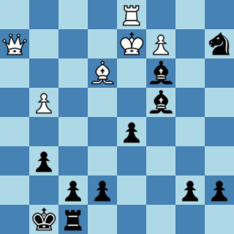

# native-chess-board

Chessboard native web component with all chess validation rules stuffed in.

So, at the very basic, all that is needed is including this in your html file:

``

and then, wherever you choose in your html's body:

`<chess-board background-schema="blue" size="400"></chess-board>`
